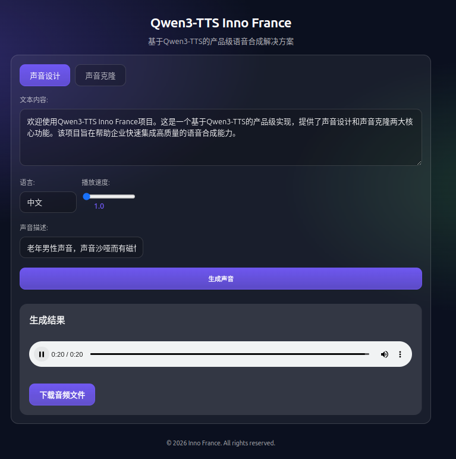
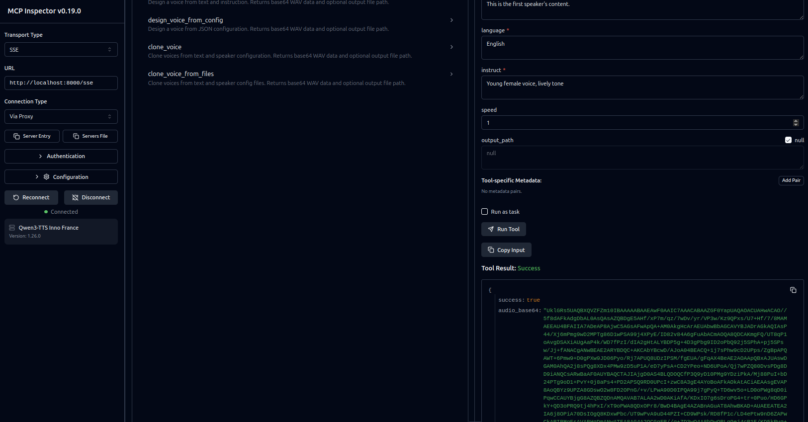

# Qwen3-TTS Inno France

Product-grade voice design and voice cloning built on Qwen3-TTS, with CLI, API, web UI, and MCP server support.

## Screenshots

Voice Design:


Voice Clone:


## Highlights

- Voice design with text + instruction prompts.
- Multi-speaker voice cloning with long-text segmentation.
- Streaming audio responses from API endpoints.
- Web UI with playback and download.
- MCP server with stdio and SSE transports.

## Installation

```bash
pip install -r requirements.txt
```

Environment variables are optional. A sample file is provided:

```bash
cp env.example .env
```

## Quick Start

```bash
export VOICE_DESIGN_MODEL_PATH=/path/to/design_model

export VOICE_CLONE_MODEL_PATH=/path/to/base_model

./app/start.sh
```

Open `http://localhost:8000` to use the web UI.

## CLI

### Voice Design

```bash
qwen3-tts-inno voice-design \
  --text "Hello, world!" \
  --language "Chinese" \
  --instruct "Young man voice" \
  --output output.wav \
  --speed 1.0
```

### Voice Design (JSON)

```bash
qwen3-tts-inno voice-design-json --config voice_design_config.json
```

Example `voice_design_config.json`:
```json
{
  "text": "Hello, world!",
  "language": "Chinese",
  "instruct": "Young female voice, lively tone",
  "output_path": "output.json.wav",
  "speed": 1.2
}
```

### Voice Clone

```bash
qwen3-tts-inno voice-clone \
  --text-file input.txt \
  --speakers-config speakers.json \
  --output output.wav \
  --speed 1.1
```

Example `input.txt`:
```
[SPEAKER0]This is the first speaker's content.
[SPEAKER1]This is the second speaker's content.
[SPEAKER0]First speaker speaks again.
```

Example `speakers.json`:
```json
[
  {
    "speaker_tag": "[SPEAKER0]",
    "ref_audio": "speaker0.wav",
    "ref_text": "Reference audio text content",
    "language": "Chinese"
  },
  {
    "speaker_tag": "[SPEAKER1]",
    "ref_audio": "speaker1.wav",
    "ref_text_file": "speaker1_text.txt",
    "language": "Chinese"
  },
  {
    "speaker_tag": "[SPEAKER2]",
    "design_text": "Reference text for voice design",
    "design_instruct": "Male voice, steady tone",
    "language": "Chinese"
  }
]
```

Speaker tags are optional but recommended for precise mapping. If omitted, the config index is used for `[SPEAKER0]`, `[SPEAKER1]`, etc.

## API Service

Start the service:

```bash
./app/start.sh
```

### Health Check

```bash
curl http://localhost:8000/health
```

### Voice Design (streamed WAV)

```bash
curl -X POST http://localhost:8000/api/voice-design \
  -F "text=Hello, world!" \
  -F "language=Chinese" \
  -F "instruct=Young female voice, lively tone" \
  -F "speed=1.2" \
  --output output_voice_design.wav
```

### Voice Clone (streamed WAV)

```bash
curl -X POST http://localhost:8000/api/voice-clone \
  -F "text=[SPEAKER0]First speaker.[SPEAKER1]Second speaker." \
  -F "speaker_configs=[{\"speaker_tag\": \"[SPEAKER0]\", \"ref_audio\": \"examples/voice_prompts/zh_old_man.wav\", \"ref_text\": \"Reference text\", \"language\": \"Chinese\"}, {\"speaker_tag\": \"[SPEAKER1]\", \"design_text\": \"Second speaker text\", \"design_instruct\": \"Male voice, calm tone\", \"language\": \"Chinese\"}]" \
  -F "speed=1.1" \
  --output output_voice_clone.wav
```

### Voice Design from JSON File

```bash
curl -X POST http://localhost:8000/api/voice-design-file \
  -F "config=@voice_design_config.json" \
  --output output_voice_design.wav
```

### Voice Clone from Files

```bash
curl -X POST http://localhost:8000/api/voice-clone-files \
  -F "text_file=@input.txt" \
  -F "speakers_config=@speakers.json" \
  -F "speed=1.1" \
  --output output_voice_clone.wav
```

## MCP Server

### STDIO transport

```bash
python -m app.mcp_server --transport stdio
```

### SSE transport

```bash
python -m app.mcp_server --transport sse --host 127.0.0.1 --port 8000
```

Tools return base64-encoded WAV data and optional saved file paths. The SSE host/port are configured when FastMCP is initialized.



## Environment Variables

`env.example` lists all supported environment variables and sample values.

- `VOICE_DESIGN_MODEL_PATH`: Voice design model path.
- `VOICE_CLONE_MODEL_PATH`: Voice clone model path.
- `ATTN_IMPLEMENTATION`: Attention implementation (default: `sdpa`).
- `DEVICE`: Inference device (default: `cuda:0`).
- `WEBAPP_PORT`: Web app port (default: `8000`).
- `LAZY_LOAD_MODELS`: Set `true` for lazy model loading.

## Python API

```python
from app.core import Qwen3TTSInnoFrance

tts = Qwen3TTSInnoFrance(device="cuda:0")
output_path = tts.voice_design_cli(
    text="Hello, world!",
    language="Chinese",
    instruct="Young female voice, lively tone",
    output_path="output.wav",
    speed=1.2,
)
```

## License

MIT